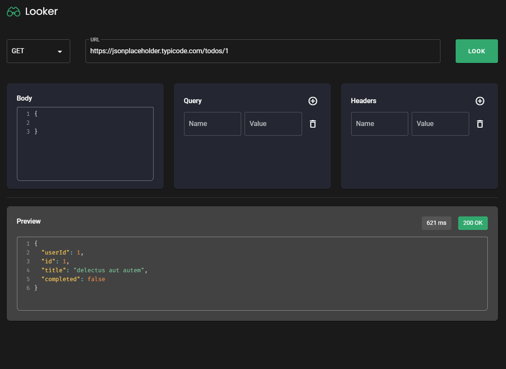
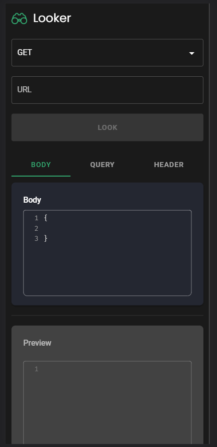

# Looker


## Links Uteis
<ul>
  <li>
    <a href="https://lucasnneto.github.io/looker/" style="display:flex;" target="_blank">
  
  <span>Website </span>
</a>
  </li>
  <li>
    <a href="https://www.figma.com/file/nZzBJYbF9NqyjPE6Mn9vY4/Looker?node-id=2%3A15" style="display:flex;" target="_blank">
  <span>Figma do projeto </span>
</a>
  </li>
</ul>

## Sobre o projeto
Projeto criado afim de estudos.

## Layout do projeto
<div style="display:flex">


</div>

## Tecnologias utilizadas
<div style="display:flex">
  <a href="https://v2.vuejs.org" style="display:flex;" target="_blank">
  
</a>
 <a href="https://vuetifyjs.com/en/" style="display:flex;" target="_blank">
  
</a>

</div>

## Autor
### Lucas Neto Oliveira
Linkedin: [linkedin.com/in/lucasnneto](https://linkedin.com/in/lucasnneto)

## Execução do projeto
### Configuração do projeto
```
npm install
```

### Compilar no ambiente de desenvolvimento
```
npm run serve
```
